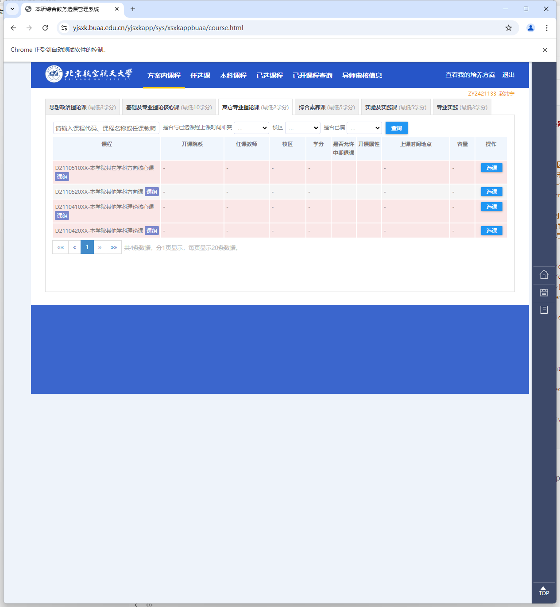
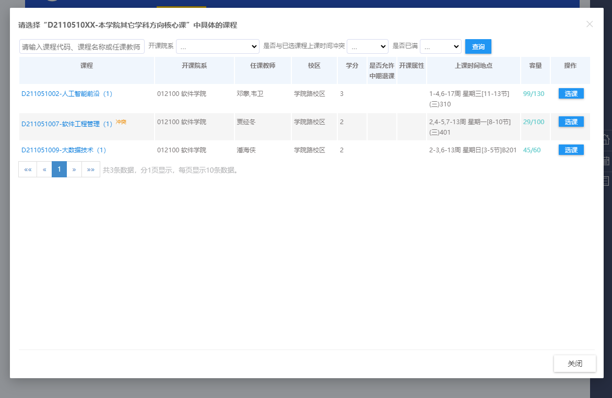
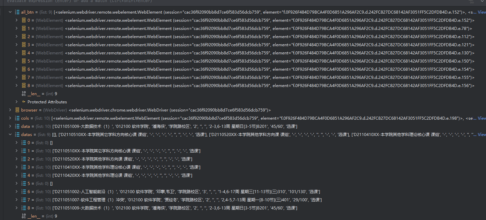

# 使用说明

## 关于配置文件

打开`config.json`，配置如下：

```json
{
  "all_todo" :  ["GA01011002-数值分析Ⅰ（学院路1班）" ], //要抢的所有课
  "username" : "", //统一认证学号
  "password" : "", //密码
  "campus": "学院路校区", //校区，用于筛选课程
  "use_campus_filter": true, // 是否开启按校区筛选
  "use_course_filter": true, //是否开启筛选”未满“课程
  "sso": "https://yjsxk.buaa.edu.cn",//统一认证url
  "course_page": "https://yjsxk.buaa.edu.cn/yjsxkapp/sys/xsxkappbuaa/course.html",//选课url
  "use_log": false,//是否开启log
  "sleep_time_after_grab": 5,//选中后等待时间（系统可能卡
  "sleep_time_after_refresh": 0.5, //界面内刷新的等待时间
  "page_alive_time": 60, //页面存活时间（超时后刷新整个网页
  "use_headless": false,//是否使用无头浏览器
  "xpaths": {
    "username_element_xpath": "/html/body/div[2]/div/div[3]/div[2]/div[1]/div[1]/div/input",//统一认证填写学号的xpath
    "password_element_xpath": "/html/body/div[2]/div/div[3]/div[2]/div[1]/div[3]/div/input",//统一认证填写密码的xpath
    "login_confirm_xpath": "/html/body/div[2]/div/div[3]/div[2]/div[1]/div[7]/input",//统一认证确认登陆button路径
    "course_part_xpath": [//选择课程板块的xpath，如果选课涉及多个板块，依次列出
      {
        "base_path":"/html/body/div/article[2]/div[2]/div/ul/li[2]",
        "have_second_path": false,//可能存在二级列表的情况，如下图
        "second_path": "",
        "xk_btn_class_name": "xkbtn",
        "refresh_btn_id": "fakzkc_queryBtn"
      },
      {
        "base_path":"/html/body/div/article[2]/div[2]/div/ul/li[2]",
        "have_second_path": true,
        "second_path": "/html/body/div/article[2]/div[2]/div/div/div[3]/div/table/tbody/tr[1]/td[10]/a",
        "xk_btn_class_name": "xkbtn",
        "refresh_btn_id": "fankc_queryBtn"
      }
    ],
    "select_confirm_xpath": "/html/body/div[3]/div[4]/div/button[1]"//确认选课的xpath
  }
}
```

忠告：

使用`import selenium`而不是from-import，后者会导致pyinstaller打包时识别不到依赖

## 关于二级列表

指的是如下情况：



点开后：



对于每一个板块：

          {
            "base_path":"/html/body/div/article[2]/div[2]/div/ul/li[2]",
            "have_second_path": true,
            "second_path": "//*[@id=\"tbody_9ed07c0c7d1340a188964c446ff98809\"]/tr[1]/td[10]/a",
            "xk_btn_class_name": "xkbtn",
            "refresh_btn_id": "fankc_queryBtn",
            "close_class_name": "zeromodal-close"
          }

`base_path`指的是最基础的板块划分，如第一张图中的思想政治理论课，基础及专业理论核心课等

`second_path`指的是上图中D2110510XX-本学院其它学科方向核心课等等的选课的button的xpath

`xk_btn_class_name`指的是选课列表的选课的button的class name，当然我这里用了弱匹配，所以匹配二级页面的时候会把一级列表的选课button给匹配到。如图：



这也是这段代码的作用：

```python
datas = datas[1:]
if part["have_second_path"]: # 删除匹配到的一级列表的选课button
    for i in range(0, len(datas)):
        if not datas[i]:
            datas = datas[i+1:]
            all_btn = all_btn[i:]
            break
```

`close_class_name`指的是二级列表的关闭的class name

## 提醒

- **无论如何配置`xk_btn_class_name`，尽量通过debug确保你的配置能够使得课程名与选课btn是对应的**
- 尽量选择复制 full xpath 
